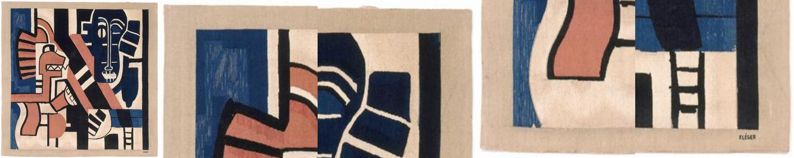
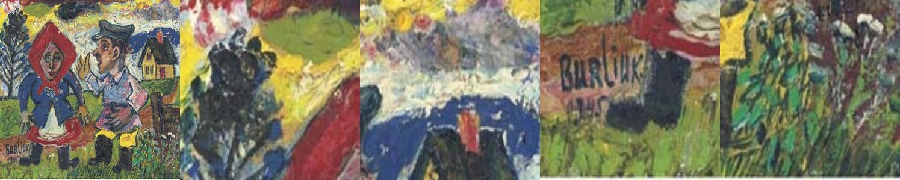
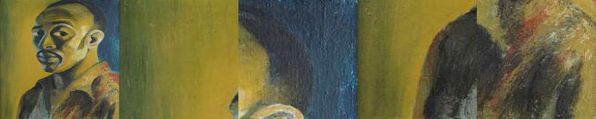

# Painters by Numbers v2

Solution for [Painters by Numbers](https://www.kaggle.com/c/painter-by-numbers) problem at Kaggle. Scoring #4 with 0.87763 AUC (private LB).

## Running

- `gen_crops`
- `gen_bottlenecks`
- `gen_metrics`
- `cache_halfsamples`
- `train` (optimal result is achieved after ~24-36 with Pascal Titan X)

## Approach

1. Use pre-trained Inception V3 to obtain 2048-dim vectors for:
  - entire image
  - zoomed corners (gives ~4-5% improvement)

2. Concatenate 5*2048-dim vectors with:
  - image dpi info
  - image aspect ratios

3. Train MLP on top of resulting 20486-dim (per pair) representations to learn if two images are by the same author.

Total number of same-artist pair-wise combinations that can be constructed in this dataset is about ~5.7M. Number of different-artist pairs is ~3.1B. This allowed to train on unseen different pairs all the way.

Balance between same-artist and diff-artist pairs was 1:2, altering it to 1:1 or 1:6 had almost no effect on end results.

## Ideas Tried

- Siamese network with VGG16: showed signs of potential convergence to a good accuracy, but required long training time.

- LSTM instead of MLP on final classifier: didn't show significant improvement on reasonable time

## Ideas Not Tried

- Ensembling/ensemble learning. Potentially +2-3% based on evidence from other projects.

- VGG19 representations from `conv5` block. Have 7x7x512 dimensions and may capture more low-level details.

- Better weights for base network or something like [Xception](https://github.com/fchollet/keras/blob/master/keras/applications/xception.py).

- Fine-tuning base network on training images by making it classify between artists/styles or on entire dataset with autoencoder-style setup.

- Augmetation of dataset images with random transformations.

- Using EXIF information (although not very useful for real-world performance :).
